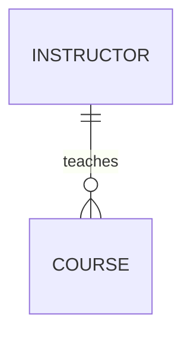
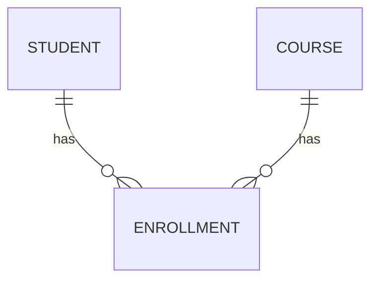
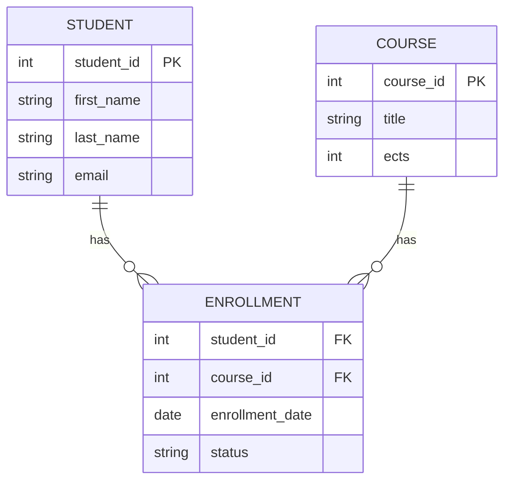

# M.000.404.vze – Databases (SQL)

## Week 2 – Practical Lab: Entity-Relationship Modeling

**Hochschule Fresenius – Computer Science, B.Sc.**  
**Winter Semester 2026/27**  
**Session:** 15 September 2026  
**Duration:** Approx. 90 minutes

---

## Learning Objectives

By the end of this practical session, you should be able to:

- identify entities, attributes, identifiers, and relationships from business requirements;
- determine relationship cardinality and optionality;
- recognize many-to-many relationships;
- use associative entities where appropriate;
- create an ER diagram in VS Code using Mermaid;
- review and improve an alternative ER model;
- document and push your work to your private GitHub repository.

---

# Business Case – Fresenius CourseHub

You are designing a database for a small university course management system.

The system must support the following requirements:

- Students enroll in courses.
- Courses are taught by instructors.
- Courses belong to degree programmes.
- Students submit assignments.
- Each assignment belongs to one course.
- A student receives one grade per assignment.

You may make reasonable assumptions if a requirement is ambiguous, but you must document those assumptions in your design notes.

---

# Activity 1 — Analyze the Requirements (15 min)

Before creating a diagram, analyze the business case.

Identify:

- candidate entities;
- possible attributes;
- identifiers;
- relationships;
- important business rules.

Do **not** start with Mermaid syntax.

First think about the business domain.

A possible starting point is:

```text
Candidate entities:
- Student
- Course
- Instructor
- DegreeProgramme
- Assignment
- Enrollment
- Submission
```

For every relationship, write one or two plain-English business rules.

Example:

```text
One Instructor may teach zero or many Courses.
Each Course must be taught by exactly one Instructor.
```

### Deliverable

Create a short list of:

1. candidate entities;
2. relationships;
3. identifiers;
4. business rules.

You will use this list in Activity 2.

---

# Activity 2 — Build the ER Diagram in VS Code with Mermaid (30 min)

Create a new file in your private repository:

```text
week-02-er-modeling/er-diagram.mmd
```

Use Mermaid ER syntax to represent your model.

Your diagram should include:

- at least five relevant entities;
- identifiers;
- important attributes;
- meaningful relationship names;
- cardinality;
- optionality where relevant;
- associative entities where appropriate.

---

## 2.1 Cardinality: Ask the Question in Both Directions

Cardinality answers the question:

> **How many instances of Entity B can be related to one instance of Entity A?**

Always ask the relationship question in **both directions**.

### Example: Instructor and Course

Business rules:

```text
One Instructor can teach many Courses.
Each Course is taught by exactly one Instructor.
```

Therefore:

```text
Instructor → Course = many
Course → Instructor = one
```

This is a:

```text
1 : N
```

or **one-to-many** relationship.

---

## 2.2 Many-to-Many Example

Consider Student and Course.

Business rules:

```text
One Student can enroll in many Courses.
One Course can contain many Students.
```

Therefore:

```text
Student → Course = many
Course → Student = many
```

This gives:

```text
M : N
```

or **many-to-many**.

In a relational design, we usually resolve this using an associative entity:

```text
STUDENT  1 ─── N  ENROLLMENT  N ─── 1  COURSE
```

`Enrollment` can also store information about the relationship itself, for example:

```text
enrollment_date
status
semester
```

---

# Mermaid Cardinality Quick Reference

Use the following table while creating your ER diagram.

> **Note:** Mermaid cardinality symbols contain the `|` character.  
> In Markdown tables, `|` is also used to separate columns.  
> Therefore the symbols below use HTML entities so they render correctly.

| Mermaid Symbol | Simple Notation | Meaning |
|---|---:|---|
| <code>o&#124;</code> | `0..1` | zero or one |
| <code>&#124;&#124;</code> | `1..1` | exactly one |
| <code>o{</code> | `0..N` | zero or many |
| <code>&#124;{</code> | `1..N` | one or many |

## How to Read the Symbols

Each Mermaid cardinality marker contains two pieces of information:

```text
Minimum:
o  = zero is allowed / optional
|  = at least one is required / mandatory

Maximum:
|  = maximum one
{  = maximum many
```

So:

```text
o|  = zero or one
||  = exactly one
o{  = zero or many
|{  = one or many
```

---

## How to Decide the Correct Cardinality

For every relationship:

### Step 1 — Ask for the maximum

```text
Can there be ONE or MANY?
```

### Step 2 — Ask for the minimum

```text
Is ZERO allowed,
or must there be AT LEAST ONE?
```

### Step 3 — Ask the same questions in the opposite direction

Do not analyze only one side of the relationship.

### Step 4 — Translate the result into Mermaid notation

First decide:

```text
0..1
1..1
0..N
1..N
```

Only then choose the Mermaid symbol.

---

## Example: Instructor and Course

Business rules:

```text
Each Course must have exactly one Instructor.

An Instructor may teach zero or many Courses.
```

Mermaid:



Read the relationship in plain English:

```text
One Course has exactly one Instructor.

One Instructor may teach zero or many Courses.
```

---

## Example: Student, Course, and Enrollment

Start with the business rules:

```text
One Student may have zero or many Enrollments.

Each Enrollment belongs to exactly one Student.

One Course may have zero or many Enrollments.

Each Enrollment belongs to exactly one Course.
```

Mermaid:



---

> **Important:** Do not start by guessing Mermaid symbols.
>
> First write the business rule in English.  
> Then determine `0..1`, `1..1`, `0..N`, or `1..N`.  
> Finally translate the result into Mermaid syntax.

---

## 2.3 Example Mermaid ER Diagram

Use the following only as a syntax reference.

Do not copy it as your final solution without analyzing the business case yourself.



Your final model should also consider the requirements about assignments, submissions, and grades.

---

## 2.4 Preview the Diagram in VS Code

Open the Mermaid preview in VS Code.

If the preview does not work:

1. check the Mermaid syntax;
2. compare your symbols with the quick reference above;
3. simplify the diagram temporarily;
4. verify one relationship at a time.

The goal of this activity is **ER modeling**, not debugging complex Mermaid syntax.

---

# Activity 3 — Peer Review (15 min)

Exchange your ER diagram with another student.

Review the model using the following checklist.

## Peer Review Checklist

### Entities

- Are important entities missing?
- Are unnecessary entities included?
- Does each entity have a clear purpose?

### Identifiers and Attributes

- Does each main entity have an identifier?
- Are important attributes included?
- Are names being used as identifiers when a more stable identifier would be better?

### Relationships

- Are relationship names meaningful?
- Are all important business relationships represented?

### Cardinality

For each relationship, ask:

```text
One A can be related to how many B?
One B can be related to how many A?
```

Then ask:

```text
Is zero allowed?
Is at least one required?
```

Check whether the Mermaid notation matches the business rule.

### Associative Entities

- Is there a many-to-many relationship?
- Does the relationship need its own attributes?
- Would an associative entity make the design clearer?

### Documentation

- Are assumptions written down?
- Can another person understand the design without asking the author?

---

# Activity 4 — Improve the Model and Document Decisions (15 min)

Use the peer-review feedback to improve your ER diagram.

Create:

```text
week-02-er-modeling/design-notes.md
```

Document at least **three design decisions**.

Example:

```markdown
## Design Decisions

1. Enrollment is modeled as an associative entity because
   Student and Course have a many-to-many relationship.

2. Each Course must have exactly one Instructor.

3. A Course may initially have no Assignments, so the
   Course-to-Assignment relationship is optional on the
   Assignment side.
```

Also document any assumptions you made.

---

# Activity 5 — Commit and Push to GitHub (15 min)

Your private repository should now contain:

```text
week-02-er-modeling/
├── README.md
├── er-diagram.md
├── er-diagram.png
└── design-notes.md
```

`er-diagram.md` is the main editable source of your ER model.

If possible, export or capture a rendered version as:

```text
er-diagram.png
```

---

## Suggested README Structure

```markdown
# Week 2 – Entity-Relationship Modeling

## Business Case

Fresenius CourseHub

## Main Entities

- Student
- Course
- Instructor
- DegreeProgramme
- Assignment
- Enrollment
- Submission

## Design Decisions

See design-notes.md.

## Diagram

The editable Mermaid source is stored in:

er-diagram.mmd
```

---

## Git Commands

Check your work:

```bash
git status
```

Stage the Week 2 files:

```bash
git add week-02-er-modeling
```

Check what will be committed:

```bash
git status
```

Commit:

```bash
git commit -m "Add Week 2 ER model and design notes"
```

Push:

```bash
git push
```

Make sure the instructor has collaborator access to your private repository.

Share the repository URL using the submission method specified by the instructor.

---

# Reflection Questions

Before finishing, answer these questions briefly in your README.md file.

1. What is the difference between an entity and an attribute?
2. Why should cardinality be analyzed in both directions?
3. What is the difference between `0..N` and `1..N`?
4. Why is `Enrollment` useful as an associative entity?
5. Which relationship in your model was the most difficult to decide?
6. What assumption did you have to make because the business requirements were not completely explicit?

---

# Completion Checklist

Before leaving the session, verify that:

- [ ] I identified the main entities.
- [ ] Each main entity has an identifier.
- [ ] I defined meaningful relationships.
- [ ] I analyzed cardinality in both directions.
- [ ] I considered optionality.
- [ ] I used an associative entity where appropriate.
- [ ] My Mermaid diagram renders successfully in VS Code.
- [ ] I created `design-notes.md`.
- [ ] I saved `er-diagram.mmd`.
- [ ] I committed my files.
- [ ] I pushed my work to my private GitHub repository.

---

# Quick Reference

## Cardinality

```text
0..1 = zero or one
1..1 = exactly one
0..N = zero or many
1..N = one or many
```

## Mermaid

```text
o| = zero or one
|| = exactly one
o{ = zero or many
|{ = one or many
```

## Recommended Workflow

```text
Business Requirement
        ↓
Plain-English Relationship
        ↓
Minimum + Maximum Cardinality
        ↓
Mermaid Symbols
        ↓
ER Diagram
        ↓
Peer Review
        ↓
Git Commit + Push
```

---

## Before Next Week

Keep your ER model available in your repository.

Next week, we will begin translating the ER model into the relational model:

```text
Entity       → Table
Attribute    → Column
Identifier   → Primary Key
Relationship → Foreign Key
```
