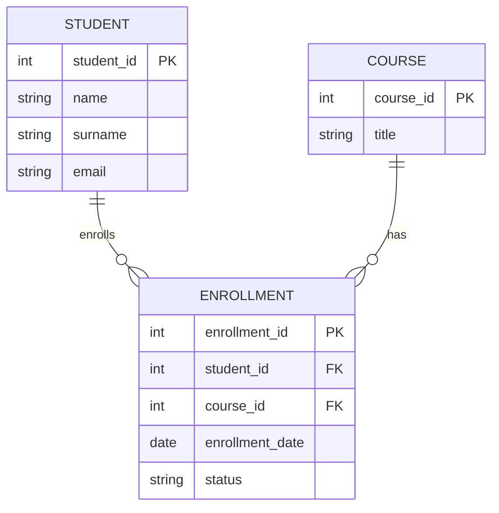

# M.000.404.vze – Databases (SQL)

## Week 3 – Practical Lab: Relational Model, ER-to-Relational Mapping & Introduction to Normalization

**Date:** 22 September 2026  
**Duration:** Approx. 90 minutes  
**Main tools:** VS Code, PostgreSQL, Docker, Git/GitHub

---

## Learning Objectives

By the end of this lab, you should be able to:

- transform an ER model into a relational schema;
- distinguish tables, rows, columns, primary keys, candidate keys, and foreign keys;
- explain how foreign keys support referential integrity;
- map 1:N and M:N relationships to relations;
- recognize simple redundancy and update problems;
- implement an initial PostgreSQL schema;
- verify the schema with simple test data;
- commit and push your work to your private GitHub repository.

---

# Starting Point

Use the Week 2 CourseHub model as your starting point:

```text
STUDENT 1 ─── N ENROLLMENT N ─── 1 COURSE
```

A simplified Mermaid version is:



---

# Activity 1 — Map the ER Model to Relations (15 min)

Create:

```text
week-03-relational-model/relational-schema.md
```

Translate each entity into a relation.

Start with this notation:

```text
STUDENT(
    student_id PK,
    name,
    surname,
    email
)

COURSE(
    course_id PK,
    title
)

ENROLLMENT(
    enrollment_id PK,
    student_id FK → STUDENT.student_id,
    course_id FK → COURSE.course_id,
    enrollment_date,
    status
)
```

Then answer:

1. Which attributes uniquely identify rows?
2. Which attributes reference another table?
3. Why are `student_id` and `course_id` stored in `ENROLLMENT`?
4. What would happen if `ENROLLMENT` contained a `student_id` that does not exist in `STUDENT`?

---

# Activity 2 — Keys and Referential Integrity (15 min)

For each table, identify:

- **Primary Key (PK)**
- possible **Candidate Key(s)**
- **Foreign Key(s)**

Consider the following business rule:

> A student email address must be unique.

This makes `email` a possible candidate key, even if `student_id` remains the primary key.

Add the following decision to `relational-schema.md`:

```text
STUDENT
Primary Key: student_id
Candidate Key: email
```

Now explain in one or two sentences:

> What is the difference between a primary key and a candidate key?

Also explain:

> What does referential integrity protect us from?

---

# Activity 3 — Analyze a Simple Redundancy Problem (15 min)

Consider this table:

| student_id | student_name | course_id | course_title | instructor_name |
|---:|---|---:|---|---|
| 1 | Anna Keller | 101 | Databases | Dr. Meyer |
| 1 | Anna Keller | 102 | Programming | Prof. Rossi |
| 2 | David Smith | 101 | Databases | Dr. Meyer |
| 3 | Maria Lopez | 101 | Databases | Dr. Meyer |

Discuss:

1. Which values are repeated?
2. What happens if the title `Databases` changes?
3. How many rows might need to be updated?
4. What happens if the only student in a course is deleted?
5. Could we accidentally store different instructor names for the same course?

Document at least **two redundancy problems** in:

```text
week-03-relational-model/normalization-notes.md
```

Then propose a better structure using separate tables.

> **Important:** This is only an introduction to normalization. You do not need to formally prove 1NF, 2NF, or 3NF today.

---

# Activity 4 — Implement the Initial PostgreSQL Schema (30 min)

Create:

```text
week-03-relational-model/sql/01_schema.sql
```

Use the following as a starting point:

```sql
CREATE TABLE student (
    student_id INTEGER GENERATED ALWAYS AS IDENTITY PRIMARY KEY,
    name VARCHAR(100) NOT NULL,
    surname VARCHAR(100) NOT NULL,
    email VARCHAR(255) NOT NULL UNIQUE
);

CREATE TABLE course (
    course_id INTEGER GENERATED ALWAYS AS IDENTITY PRIMARY KEY,
    title VARCHAR(200) NOT NULL
);

CREATE TABLE enrollment (
    enrollment_id INTEGER GENERATED ALWAYS AS IDENTITY PRIMARY KEY,
    student_id INTEGER NOT NULL,
    course_id INTEGER NOT NULL,
    enrollment_date DATE NOT NULL,
    status VARCHAR(50) NOT NULL,

    CONSTRAINT fk_enrollment_student
        FOREIGN KEY (student_id)
        REFERENCES student(student_id),

    CONSTRAINT fk_enrollment_course
        FOREIGN KEY (course_id)
        REFERENCES course(course_id),

    CONSTRAINT uq_student_course
        UNIQUE (student_id, course_id)
);
```

## Run the Schema

If PostgreSQL is running in Docker:

```bash
docker compose ps
```

Copy or execute the SQL using your preferred method, for example `psql` or pgAdmin.

If your PostgreSQL container is named `postgres_db`, one possible command is:

```bash
docker exec -i postgres_db psql -U myuser -d mydb < week-03-relational-model/sql/01_schema.sql
```

Adapt the user, database name, or container name if your configuration is different.

## Verify the Tables

In `psql`:

```sql
\dt
```

Inspect one table:

```sql
\d student
\d course
\d enrollment
```

---

# Activity 5 — Test Constraints, Commit, and Push (15 min)

Create:

```text
week-03-relational-model/sql/02_test_data.sql
```

Add a few valid rows:

```sql
INSERT INTO student (name, surname, email)
VALUES
    ('Anna', 'Keller', 'anna@example.com'),
    ('David', 'Smith', 'david@example.com');

INSERT INTO course (title)
VALUES
    ('Databases'),
    ('Programming');

INSERT INTO enrollment (student_id, course_id, enrollment_date, status)
VALUES
    (1, 1, '2026-09-22', 'active'),
    (1, 2, '2026-09-22', 'active'),
    (2, 1, '2026-09-22', 'active');
```

Now deliberately test one invalid foreign key:

```sql
INSERT INTO enrollment (student_id, course_id, enrollment_date, status)
VALUES (999, 1, '2026-09-22', 'active');
```

### Question

Why should PostgreSQL reject this row?

Document the error and explain it briefly in `README.md`.

---

# Required Repository Structure

```text
week-03-relational-model/
├── README.md
├── relational-schema.md
├── normalization-notes.md
└── sql/
    ├── 01_schema.sql
    └── 02_test_data.sql
```

---

# Git Submission

Check your changes:

```bash
git status
```

Stage the Week 3 folder:

```bash
git add week-03-relational-model
```

Commit:

```bash
git commit -m "Add Week 3 relational model and initial PostgreSQL schema"
```

Push:

```bash
git push
```

Make sure the instructor has collaborator access to your private repository.

---

# Completion Checklist

- [ ] I transformed the ER model into relations.
- [ ] I identified primary keys.
- [ ] I identified at least one candidate key.
- [ ] I identified foreign keys.
- [ ] I can explain referential integrity.
- [ ] I identified at least two redundancy problems.
- [ ] I created `01_schema.sql`.
- [ ] PostgreSQL created all three tables successfully.
- [ ] I tested valid data.
- [ ] I tested an invalid foreign-key reference.
- [ ] I documented the result.
- [ ] I committed and pushed my work to GitHub.

---

# Quick Reference

```text
ER Entity        → Relation / Table
ER Attribute     → Column
Identifier       → Primary Key
1:N relationship → Foreign Key on the N-side
M:N relationship → Associative / junction table
```

```text
Primary Key:
Uniquely identifies each row and cannot be NULL.

Candidate Key:
Any minimal attribute or attribute set that could uniquely identify a row.

Foreign Key:
References a candidate/primary key in another relation.

Referential Integrity:
Prevents references to non-existing parent rows.
```

---

## Next Step

In the next SQL-focused sessions, this schema will become the foundation for DDL, DML, querying, constraints, and later the CourseHub application.
